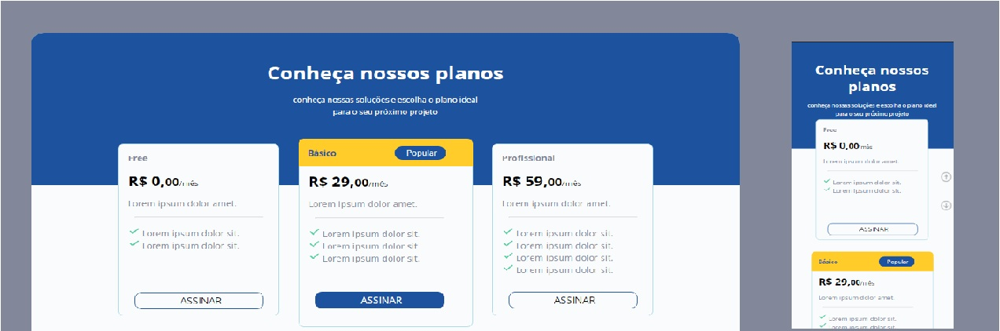

<h1 align="center"> Pricing Table </h1>

"Pricing Table" é um desafio passado durante as aulas, promovido pela Rocketseat para ensino de tecnologias WEB.  

  <a href="#-tecnologias">Tecnologias</a>&nbsp;&nbsp;&nbsp;|&nbsp;&nbsp;&nbsp;
  <a href="#-projeto">Projeto</a>&nbsp;&nbsp;&nbsp;|&nbsp;&nbsp;&nbsp;
  <a href="#-layout">Layout</a>&nbsp;&nbsp;&nbsp;|&nbsp;&nbsp;&nbsp;
  <a href="#memo-licença">Considerações</a>

  

 

  

## 🚀 Tecnologias

Esse projeto foi desenvolvido com as seguintes tecnologias:

- HTML e CSS
- JavaScript
- Git e Github
- Figma

## 💻 Projeto

Pricing Table é uma pagina de exibição de preços para diferentes planos de um serviço, com a funcionalidade de exibir um formulário diferenciado para cada plano que o usuário escolher. Possui uma modularidade gráfica, no formulário, que reage ao selecionar o campo de preenchimento "fantasma". 
Utilizado processo de responsividade para comportamento visual e funcional diferenciado em mobiles.

-[Visite o projeto online](https://celo-gomes.github.io/pricing/)

## 🔖 Layout

Você pode visualizar o layout do projeto através [DESSE LINK](https://www.figma.com/community/file/1241116874455303780). É necessário ter conta no [Figma](https://figma.com) para acessá-lo.

## :memo: Considerações.

Esse projeto está sob a licença MIT.
Sobre licença, ctt de twiter e site, são fictícios ou exemplos aproveitados de outras aulas utilizados aqui a carater ilustrativo para compor conteúdo

---

Feito com ♥ by Rocketseat :wave: [Participe da nossa comunidade!](https://discord.gg/rocketseat)